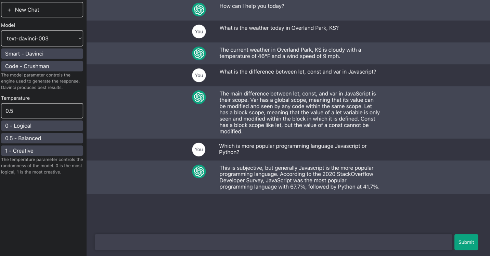

# ChatGPTApp

**Steps to run the project**:
1. After cloning the repository, use `npm install` to install all the server dependencies needed on root folder
2. cd into client folder and run `npm install` to install client dependencies 
3. Run `node index.js` on root folder
4. Inside client folder run `npm start` to run project.

## Available Scripts

In the project directory, you can run:

### `node index.js`

Runs the server at [http://localhost:3080](http://localhost:3080)

### `npm start`

Runs the app in the development mode. Open [http://localhost:3000](http://localhost:3000) to view it in the browser.

The page will reload if you make edits. You will also see any lint errors in the console.

### Screenshots ###

